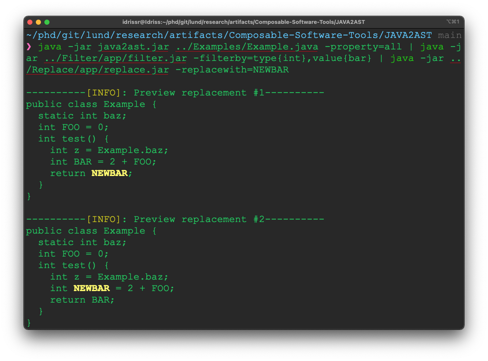
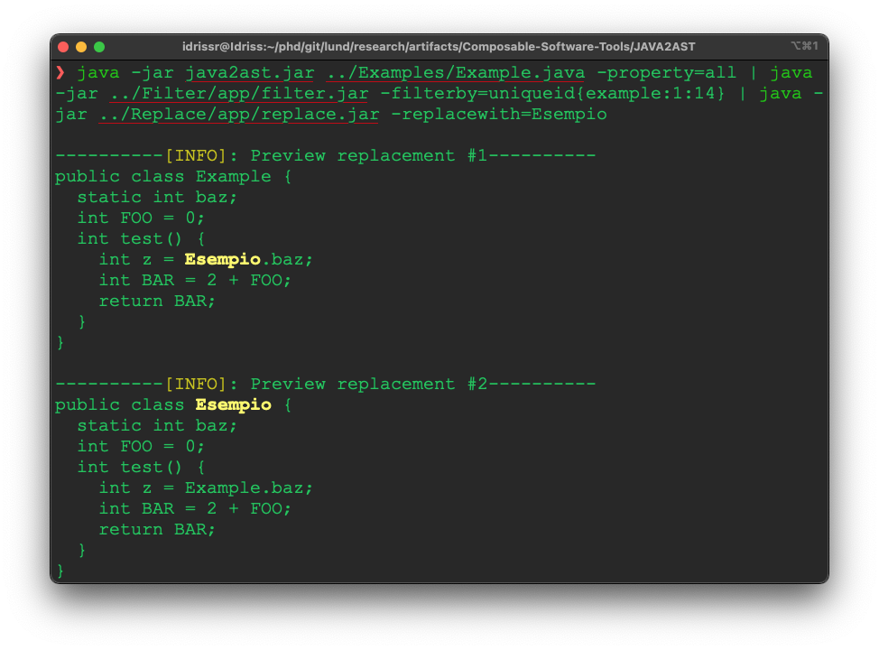
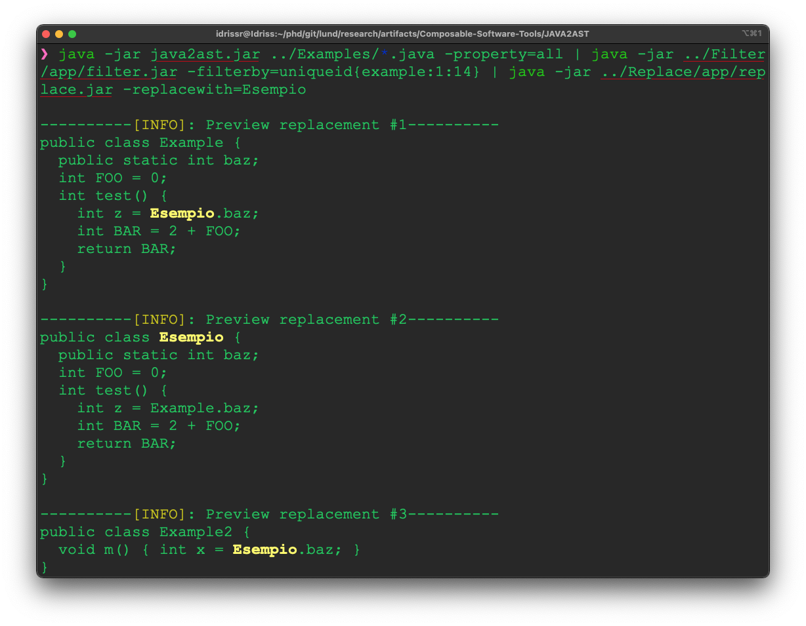

# Examples
In this `README.md` we will present some example of how to use some of the tools inclueded in this repository.

The running example is the following one:
```java
public class Example {
  static int baz;
  int FOO = 0;
  int test() {
    int z = Example.baz;
    int BAR = 2 + FOO;
    return BAR;
  }
}

```

Let us move into the directory `JAVA2AST`
```
cd JAVA2AST
```

Let us get all the interesting information in the file `Example.java`.

```
java -jar java2ast.jar ../Examples/Example.java -property=all
```
This command will generate the following table
```
+---------------------+------------+----------+--------------+------------+--------------------------+-------------+----------+-----------------+------------------+-------------+----------+---------------+----------+---------+---------+--------------+
         NAME         | LINE_START | LINE_END | COLUMN_START | COLUMN_END |         REL_PATH         |    VALUE    |   TYPE   | ENCLOSING_CLASS | ENCLOSING_METHOD | IN_A_METHOD | A_METHOD | AN_INITALISER | IS_CLASS | IS_STMT | IS_EXPR |   UNIQUEID   |
+---------------------+------------+----------+--------------+------------+--------------------------+-------------+----------+-----------------+------------------+-------------+----------+---------------+----------+---------+---------+--------------+
      TypeAccess      |     5      |    5     |      13      |     19     | ../Examples/Example.java |   Example   | Example  |     Example     |       test       |    true     |  false   |     false     |  false   |  false  |  true   | Example:1:14 |
    IntegerLiteral    |     3      |    3     |      13      |     13     | ../Examples/Example.java |      0      |   int    |     Example     |        -         |    false    |  false   |     false     |  false   |  false  |  true   |      -       |
       VarAccess      |     5      |    5     |      21      |     23     | ../Examples/Example.java |     baz     |   int    |     Example     |       test       |    true     |  false   |     false     |  false   |  false  |  true   |   baz:2:14   |
  PrimitiveTypeAccess |     4      |    4     |      3       |     5      | ../Examples/Example.java |     int     |   int    |     Example     |       test       |    true     |  false   |     false     |  false   |  false  |  true   |   int:0:0    |
        AddExpr       |     6      |    6     |      15      |     21     | ../Examples/Example.java |   2 + FOO   |   int    |     Example     |       test       |    true     |  false   |     false     |  false   |  false  |  true   |      -       |
  VariableDeclarator  |     5      |    5     |      9       |     9      | ../Examples/Example.java |      z      |   int    |     Example     |       test       |    true     |  false   |     false     |  false   |  false  |  false  |    z:5:9     |
    FieldDeclarator   |     3      |    3     |      7       |     13     | ../Examples/Example.java |      -      |    -     |     Example     |        -         |    false    |  false   |     false     |  false   |  false  |  false  |   FOO:3:7    |
      ReturnStmt      |     7      |    7     |      5       |     15     | ../Examples/Example.java |      -      |    -     |     Example     |       test       |    true     |  false   |     false     |  false   |  true   |  false  |      -       |
       FieldDecl      |     2      |    2     |      3       |     17     | ../Examples/Example.java |      -      |    -     |     Example     |        -         |    false    |  false   |     false     |  false   |  false  |  false  |      -       |
       VarAccess      |     7      |    7     |      12      |     14     | ../Examples/Example.java |     BAR     |   int    |     Example     |       test       |    true     |  false   |     false     |  false   |  false  |  true   |   BAR:6:9    |
       Modifier       |     2      |    2     |      3       |     8      | ../Examples/Example.java |   static    | Modifier |     Example     |        -         |    false    |  false   |     false     |  false   |  false  |  false  |      -       |
  PrimitiveTypeAccess |     3      |    3     |      3       |     5      | ../Examples/Example.java |     int     |   int    |     Example     |        -         |    false    |  false   |     false     |  false   |  false  |  true   |   int:0:0    |
       VarAccess      |     6      |    6     |      19      |     21     | ../Examples/Example.java |     FOO     |   int    |     Example     |       test       |    true     |  false   |     false     |  false   |  false  |  true   |   FOO:3:7    |
      MethodDecl      |     4      |    8     |      7       |     11     | ../Examples/Example.java |    test     |   int    |     Example     |        -         |    false    |   true   |     false     |  false   |  false  |  false  |      -       |
       ClassDecl      |     1      |    1     |      14      |     20     | ../Examples/Example.java |      -      | Example  |        -        |        -         |    false    |  false   |     false     |   true   |  false  |  false  | Example:1:14 |
  PrimitiveTypeAccess |     2      |    2     |      10      |     12     | ../Examples/Example.java |     int     |   int    |     Example     |        -         |    false    |  false   |     false     |  false   |  false  |  true   |   int:0:0    |
  PrimitiveTypeAccess |     5      |    5     |      5       |     7      | ../Examples/Example.java |     int     |   int    |     Example     |       test       |    true     |  false   |     false     |  false   |  false  |  true   |   int:0:0    |
    FieldDeclarator   |     2      |    2     |      14      |     16     | ../Examples/Example.java |      -      |    -     |     Example     |        -         |    false    |  false   |     false     |  false   |  false  |  false  |   baz:2:14   |
          Dot         |     0      |    0     |      0       |     0      | ../Examples/Example.java | Example.baz |   int    |     Example     |       test       |    true     |  false   |     false     |  false   |  false  |  true   |      -       |
         Block        |     4      |    8     |      14      |     3      | ../Examples/Example.java |      -      |    -     |     Example     |       test       |    true     |  false   |     false     |  false   |  true   |  false  |      -       |
  VariableDeclarator  |     6      |    6     |      9       |     11     | ../Examples/Example.java |     BAR     |   int    |     Example     |       test       |    true     |  false   |     false     |  false   |  false  |  false  |   BAR:6:9    |
    IntegerLiteral    |     6      |    6     |      15      |     15     | ../Examples/Example.java |      2      |   int    |     Example     |       test       |    true     |  false   |     false     |  false   |  false  |  true   |      -       |
      VarDeclStmt     |     5      |    5     |      5       |     24     | ../Examples/Example.java |      -      |    -     |     Example     |       test       |    true     |  false   |     false     |  false   |  true   |  false  |      -       |
       FieldDecl      |     3      |    3     |      3       |     14     | ../Examples/Example.java |      -      |    -     |     Example     |        -         |    false    |  false   |     false     |  false   |  false  |  false  |      -       |
  PrimitiveTypeAccess |     6      |    6     |      5       |     7      | ../Examples/Example.java |     int     |   int    |     Example     |       test       |    true     |  false   |     false     |  false   |  false  |  true   |   int:0:0    |
       Modifier       |     1      |    1     |      1       |     6      | ../Examples/Example.java |   public    | Modifier |     Example     |        -         |    false    |  false   |     false     |  false   |  false  |  false  |      -       |
      VarDeclStmt     |     6      |    6     |      5       |     22     | ../Examples/Example.java |      -      |    -     |     Example     |       test       |    true     |  false   |     false     |  false   |  true   |  false  |      -       |
+---------------------+------------+----------+--------------+------------+--------------------------+-------------+----------+-----------------+------------------+-------------+----------+---------------+----------+---------+---------+--------------+
```

## Renaming local variable `BAR`
In this example we will rename the local variable BAR, filtering by the name and the type of the variable. This is done by filtering the result produced by `JAVA2AST:
```
java -jar java2ast.jar ../Examples/Example.java -property=all | java -jar ../Filter/app/filter.jar -filterby=type{int},value{bar}
```
Producing the following result:
```
+--------------------+------------+----------+--------------+------------+--------------------------+-------+------+-----------------+------------------+-------------+----------+---------------+----------+---------+---------+----------+
         NAME        | LINE_START | LINE_END | COLUMN_START | COLUMN_END |         REL_PATH         | VALUE | TYPE | ENCLOSING_CLASS | ENCLOSING_METHOD | IN_A_METHOD | A_METHOD | AN_INITALISER | IS_CLASS | IS_STMT | IS_EXPR | UNIQUEID |
+--------------------+------------+----------+--------------+------------+--------------------------+-------+------+-----------------+------------------+-------------+----------+---------------+----------+---------+---------+----------+
      VarAccess      |     7      |    7     |      12      |     14     | ../Examples/Example.java |  BAR  | int  |     Example     |       test       |    true     |  false   |     false     |  false   |  false  |  true   | BAR:6:9  |
  VariableDeclarator |     6      |    6     |      9       |     11     | ../Examples/Example.java |  BAR  | int  |     Example     |       test       |    true     |  false   |     false     |  false   |  false  |  false  | BAR:6:9  |
+--------------------+------------+----------+--------------+------------+--------------------------+-------+------+-----------------+------------------+-------------+----------+---------------+----------+---------+---------+----------+
```
With the following command we can replace the variables name (identified with the source location) with a new name, e.g., NEWBAR:
```
java -jar java2ast.jar ../Examples/Example.java -property=all | java -jar ../Filter/app/filter.jar -filterby=type{int},value{bar} | java -jar ../Replace/app/replace.jar -replacewith=NEWBAR
```
This command will not change the original source file, but will print on standard output a preview of all the changes:



While, adding the flag `-fix` will directly apply the changes on the original file.

## Renaming variables usign variable identifier
In this example we will use the `UniqueID` to identify an object in our Java file. In this case, we want to rename all the uses of the variable `FOO` declared at line 3, with `field_foo`. `UniqueID` is an unique identifier composed by `OBJECT_NAME, DECL LINE START, DECL COLUMN START".

```
java -jar java2ast.jar ../Examples/Example.java -property=all | java -jar ../Filter/app/filter.jar -filterby=uniqueid{foo:3:7} | java -jar ../Replace/app/replace.jar -replacewith=field_FOO
```
resulting in the following replacements:
.


## Renaming class and all its uses
UniqueID is provided also to `Type Declarations` and `Type Accesses`. In this case, we will replace all the uses of the class `Example` with `Esempio` (i.e., Example in italian). This will result in the following replacements:
.


## Renaming within multiple compilation units
In this example we will introduce a new file `Example2.java` defined as follow:
```java
public class Example2 {
  void m() { int x = Example.baz; }
}
```

As before, we want to rename all the occurrence of `Example` with `Esempio`. This is done by running the following command:
```java -jar java2ast.jar ../Examples/*.java -property=all | java -jar ../Filter/app/filter.jar -filterby=uniqueid{example:1:14} | java -jar ../Replace/app/replace.jar -replacewith=Esempio```
The only difference between this command and the one presented in `Renaming class and all it uses` is that we are passing all the involved java file. In this case this is done with `../Examples/*.java`.

.


